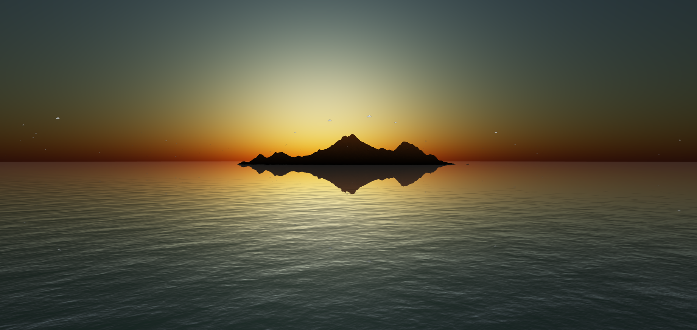

# Contents
- [Introduction](#introduction)
- [Media and screenshots](#media-and-screenshots)
- [Credits](#credits)

# Introduction
Kamigen is a tropical cyberpunk (science fiction) world with aircraft combat. Drop into the pilot seat and join the struggle or read the story in the comics. 

- [Official Website](https://kamigen.com/)
- [Comics](https://kamigen.com/comics.html)
- [Play the Alpha Build](https://kamigen.com/game.html)
- [Audio Loop Demo](https://kamigen.com/music/flying.html)

[Open Studios](https://openstudios.xyz) is producing Kamigen under an MIT license with all art and source code being freely available. This project [needs your support](https://openstudios.xyz/donate.html)!

# Story and setting
The lore is currently being fleshed out by the comics which also serves to generate artwork and build an audience for all Kamigen media.

[Camiguin Island](https://en.wikipedia.org/wiki/Camiguin) in the Philippines is the inspiration for Kamigen Island. Aspects of Filipino, Mindanao and Visayan culture are referenced for Kamigen new art and ideas.

The in-game island is generated from a [height map of the actual Camiguin island](./assets/height.png), with some tweaks.

[Traditional Baybayin script](https://en.wikipedia.org/wiki/Baybayin) (known as Badlit in the Visayas) will be a native peoples language in the Kamigen story as a tribute to indigenous peoples of all lands who were disaffected by colonisation
  - The official website footer link to home currently has "Kamigen" written in Badlit instead of the official logo font

Check out the [comics](https://kamigen.com/comics.html) for more.

# Media and screenshots

# Credits:
- [Camo texture on Deviantart](https://www.deviantart.com/sargy001/art/Tropical-Camo-347462946)
- [Terrain.Party - Heightmap texture source](https://terrain.party/)
- [Heightmap texturing solution](https://stemkoski.github.io/Three.js/Shader-Heightmap-Textures.html)
- [Music using Surikov's Web Audio Font](https://github.com/surikov/webaudiofont)
- [Badlit font resource on Deviantart](https://www.deviantart.com/akopito/art/Bisaya-Modern-Badlit-Font-Tupong-325656389)